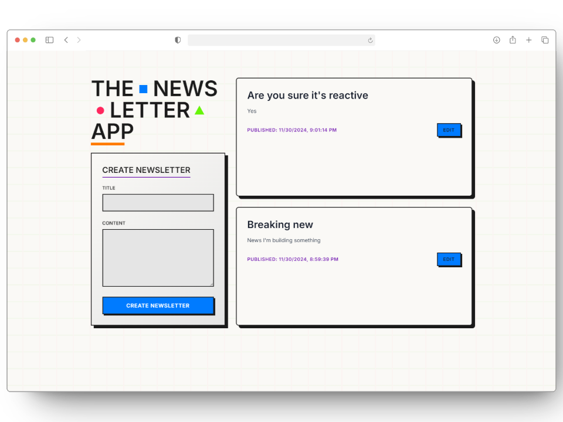

<div align="center">

# 📮 PostgreSQL Reactive Newsletter

A real-time newsletter application showcasing PostgreSQL's NOTIFY/LISTEN feature for reactive updates, inspired by modern databases like Convex.



</div>

## 💡 The Idea

While exploring Convex DB's real-time features, I wondered: "Could we achieve something similar with good old PostgreSQL?" Turns out, we can! This project demonstrates how to build reactive features using PostgreSQL's NOTIFY/LISTEN mechanism, paired with Server-Sent Events (SSE) for efficient real-time updates.

Why SSE instead of WebSocket? Sometimes simpler is better! SSE provides a lightweight, one-way communication channel that's perfect for real-time updates, with built-in reconnection handling and better HTTP integration.

## Key Features

- **Real-time Updates**: PostgreSQL NOTIFY/LISTEN + SSE for instant data synchronization
- **Modern Stack**: FastAPI for async operations, PostgreSQL for reliable data storage
- **Efficient Communication**: Server-Sent Events for lightweight real-time updates

## Try It Yourself

1. **Prerequisites**:
   ```bash
   - Python 3.7+
   - PostgreSQL 9.5+
   ```

2. **Quick Setup**:
   ```bash
   # Install dependencies
   pip install -r requirements.txt

   # Set up your database
   CREATE DATABASE dum_db;
   CREATE TABLE newsletters (
       id SERIAL PRIMARY KEY,
       title TEXT NOT NULL,
       content TEXT NOT NULL,
       created_at TIMESTAMP DEFAULT CURRENT_TIMESTAMP
   );
   ```

3. **Run It**:
   ```bash
   python main.py
   # Visit http://localhost:8000 and watch the real-time magic happen!
   ```

## How It Works

1. **The Flow**:
   - PostgreSQL notifies on data changes
   - FastAPI listens and forwards updates
   - SSE delivers updates to the browser
   - UI updates instantly

2. **The Stack**:
   - FastAPI for modern async Python
   - PostgreSQL's built-in pub/sub
   - Server-Sent Events for real-time updates

## 🎯 Key Takeaway

You don't always need specialized real-time databases or complex WebSocket setups. Sometimes, combining traditional tools in creative ways (PostgreSQL + SSE) can give you similar capabilities with less complexity.

<div align="center">

---
Built with ♥ by [#V0ID](https://github.com/v0id-user)

</div>
